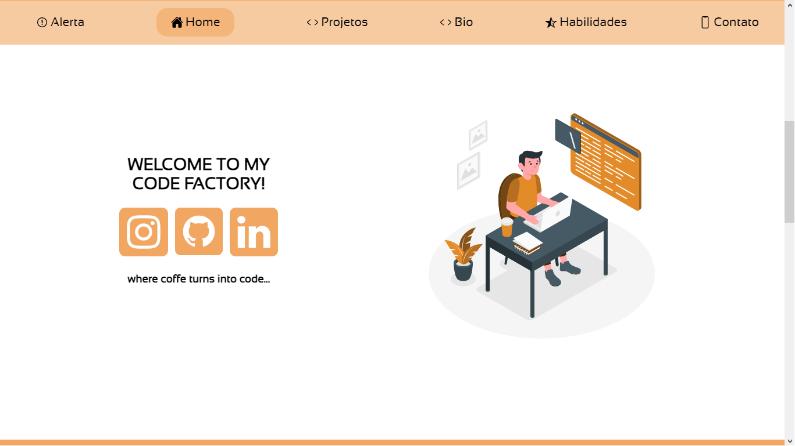

<h1 align="center"> Portfólio 💻 </h1>

Meu portfólio profissional.

<h2 align="left"> Objetivos 📌 </h2>

- Criar um local central de divulgação para o meu trabalho.

---

<h3 align="center"> Main page 📷 </h3>

<h3 align="center"> Tecnologias utilizadas 🤖 </h3>

> 

